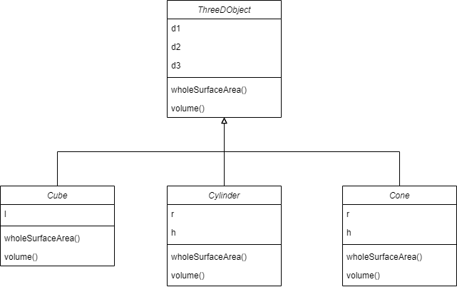

# Object-Oriented-Programming-Using-JAVA-Lab
All Object Oriented Programming Using JAVA Laboratory (PCC-CS594D) assignments for ready reference

# DAY-1
| Question | Link |
|----------|------|
| Write a Java Program to print your name. | [link](DAY-1/Assignments/MyName.java) |
| Write a Java program to add two numbers. | [link](DAY-1/Assignments/Addition.java) |
| Write a Java program to change temperature from Celsius to Fahrenheit. | [link](DAY-1/Assignments/ChangeTemp.java) |
| Write a Java program to find the area and perimeter of a rectangle. | [link](DAY-1/Assignments/AreaPerimeter.java) |
| Write a Java program to display whether a number is odd or even. | [link](DAY-1/Assignments/OddEven.java) |

# DAY-2
| Question | Link |
|----------|------|
| Write a Java Program to check if a number is Positive or Negative. | [link](DAY-2/Assignments/PosNeg.java) |
| Write a Java program to find maximum of three numbers. | [link](DAY-2/Assignments/MaxOfThree.java) |
| Write a Java program to swap two numbers. | [link](DAY-2/Assignments/SwapNums.java) |
| Write a Java program to convert miles to kilometres. | [link](DAY-2/Assignments/MltoKm.java) |
| Write a Java program to check whether a year is leap year or not. | [link](DAY-2/Assignments/IsLeap.java) |
| Write a Java program for following grading system. | [link](DAY-2/Assignments/Grading.java) |
| Write a Java program to check whether a number is divisible by 5 or not. | [link](DAY-2/Assignments/Div5.java) |
| Write a Java program to calculate factorial of a number. | [link](DAY-2/Assignments/Factorial.java) |
| Write a Java program for Fibonacci series. | [link](DAY-2/Assignments/FibonacciSeries.java) |
| Write a Java program to reverse a number. | [link](DAY-2/Assignments/ReverseOfNumber.java) |

# DAY-3
| Question | Link |
|----------|------|
| Number Pattern Program in Java: 1 2 3 4 5 6 7 8 9 10 11 12 13 14 15  | [link](DAY-3/Assignments/NumberPattern1.java) |
| Number Pattern Program in Java: &nbsp;&nbsp;&nbsp;&nbsp;&nbsp;&nbsp;&nbsp;&nbsp; 1 &nbsp;&nbsp;&nbsp;&nbsp;&nbsp; 2 1 2 &nbsp;&nbsp;  3 2 1 2 3 4 3 2 1 2 3 4 | [link](DAY-3/Assignments/NumberPattern2.java) |
| Pattern Program in Java: \*********** &nbsp;\*&nbsp;&nbsp;&nbsp;&nbsp;&nbsp;&nbsp;&nbsp;&nbsp;&nbsp;&nbsp;&nbsp; * &nbsp;&nbsp;&nbsp;\*&nbsp;&nbsp;&nbsp;&nbsp;&nbsp;&nbsp;&nbsp; * &nbsp;&nbsp;&nbsp;&nbsp;&nbsp;&nbsp;\*&nbsp;&nbsp; * &nbsp;&nbsp;&nbsp;&nbsp;&nbsp;&nbsp;&nbsp;&nbsp;\*  | [link](DAY-3/Assignments/StarPattern1.java) |
| Write a Java program to calculate Sum & Average of an integer array. | [link](DAY-3/Assignments/SumAvgArray.java) |
| Write a Java program to find out the maximum & minimum integer of array. | [link](DAY-3/Assignments/MinMaxArray.java) |
| Write a Java program to calculate Sum of two 2-dimensional arrays. | [link](DAY-3/Assignments/MatSum.java) |
| Write a Java program to search an element in an array. | [link](DAY-3/Assignments/SearchArr.java) |
| Write a Java program to find the sum of even numbers in an integer array. | [link](DAY-3/Assignments/SumEvenArray.java) |
| Write a Java program to find the sum of diagonal elements in a 2D array. | [link](DAY-3/Assignments/MatDiagonalSum.java) |
| Find difference between sums of two diagonals in a 2D array. | [link](DAY-3/Assignments/DiffSumDigonal.java) |
| Reverse the elements in an array of integers without using a second array. | [link](DAY-3/Assignments/ReverseArray.java) |

# DAY-4
| Question | Link |
|----------|------|
| Write a Java program to multiply two matrices. | [link](DAY-4/MatMult.java) |
| Write a Java program to subtract two matrices. | [link](DAY-4/MatDiff.java) |
| Program to find the frequency of each element of an array. | [link](DAY-4/FrequecyArray.java) |
| Write a Java program to print every alternate number of a given array. | [link](DAY-4/AlternateArray.java) |
| Given are two one-dimensional arrays A & B, which are sorted in ascending order. Write a Java program to merge them into single sorted array C that contains every item from arrays A & B, in ascending order. | [link](DAY-4/SortedMerge.java) |
| Write a Java program to show 0-arguments constructor. | [link](DAY-4/ComplexTest.java) |
| Write a Java program to show parameterized constructor. | [link](DAY-4/ComplexTest.java) |
| Write a Java program to show constructor overloading. | [link](DAY-4/ComplexTest.java) |
| Write a class, `Commission`, which has an instance variable, `sales`; an appropriate constructor; and a method, `commission()` that returns the commission. Now write a demo class to test the `Commission` class by reading a sale from the user, using it to create a Commission object after validating that the value is not negative. Finally, call the `commission()` method to get and print the commission. If the sales are negative, your demo should print the message “Invalid Input”. | [link](DAY-4/CommissionTest.java) |
| Circle Class | [link](DAY-4/CircleTest.java) |

# DAY-5
| Question | Link |
|----------|------|
| Write a class, `Grader`, which has an instance variable, `score`, an appropriate constructor and appropriate methods. A method, `letterGrade()` that returns the letter grade as O/E/A/B/C/F. Now write a demo class to test the `Grader` class by reading a score from the user, using it to create a `Grader` object after validating that the value is not negative and is not greater than 100. Finally, call the `letterGrade()` method to get and print the grade | [link](DAY-5/GraderTest.java) |
| Write a program that defines a class with one static variable called `cnt`. Create two or more objects of the class. The class also contains a method that increments the `cnt` variable whenever a new instance of the class is created. Write a driver class to test the above class. | [link](DAY-5/CounterTest.java) |
| Create a class called `Employee`. `Employee` has three private data members `name`, `department` and `salary`. Initialize these data member via constructor. Display all the information for 5 employee of same company. Also display name of their company. Use static member concept to implement this code. | [link](DAY-5/EmployeeTest.java) |
| Create a book shop maintains the inventory of books that are being sold at the shop. The list includes details such as `author`, `title`, `price`, `publisher` and `stock position`. Design a system using a class called `Books` with suitable member methods and constructors. Store the information of 10 books in the system and display the name of the book having the highest price. | [link](DAY-5/BookTest.java) |
| Create a class named `Employee` to store information of an employee (`emp_no`, `name`, `department`, `basic_pay`, `DA`, `HRA` and `gross_salary`). Write a program, which will take as input the `emp_no`, `name`, `department`, `basic_pay` for several employees. The program will calculate the `DA`, `HRA` and `total` for each employee and display the details of the employee having the highest gross salary. | [link](DAY-5/Employee2Test.java) |
| Imagine a tollbooth and a bridge. Cars passing by have to pay Rs. 50 Some cars passed by without paying the tax and some have to pay. Display messages &nbsp;&nbsp;&nbsp; A. No. of cars passed by, &nbsp;&nbsp;&nbsp; B. Total no. of cars who have not paid the tax &nbsp;&nbsp;&nbsp; C. Amount of cash collected. | [link](DAY-5/TollBooth.java) |

# DAY-6
| Question | Link |
|----------|------|
| Create a class called `Time`, which has three private instance variables – `hour`, `min` and `sec`. It contains a method called `add()` which takes one `Time` object as parameter and print the added value of the calling `Time` object and passes `Time` object. In the main method, declare two `Time` objects and assign values using constructor and call the `add()` method. | [link](DAY-6/TimeTest.java) |
| Create a class called `Complex`, which has two instance variables – real and imaginary. It contains methods called `add()`, `sub()`, `mult()`, `div()`, which takes one `Complex` object as parameter and print the added value of the calling `Complex` object and the `Complex` object passed as parameter. In the main method, declare two `Complex` objects and assign values using constructor and call the methods. | [link](DAY-6/ComplexTest.java) |
| Define a class called `Circle` that contains: &nbsp;&nbsp;&nbsp; • Two private instance variables: `radius` (of type double) and `color` (of type String), &nbsp;&nbsp;&nbsp; • Initialize the variables `radius` and `color` with default value of `1.0` and `"red"`, respectively using default constructor. &nbsp;&nbsp;&nbsp; • Include a second constructor that will use the default value for `color` and sets the `radius` to the value passed as parameter. &nbsp;&nbsp;&nbsp; • Two public methods: `getRadius()` and `getArea()` for returning the radius and area of circle  | [link](DAY-6/CircleTest.java) |
| Write a program to define a class `Item` containing `code` and `price`. Accept this data for five objects using array of objects. Display `code`, `price` in tabular form and also, display total price of all items. | [link](DAY-6/ItemTest.java) |
| Write a program to define a class `Tender` containing data members `cost` and `company name`. Accept data for five objects and display company name for which cost is minimum.| [link](DAY-6/TenderTest.java) |
| Create a `Circle` class & a `Point` class. The coordinates of the circle are given and used within the `Circle` class as object of the `Point` class. Display the radius and point (x,y) of the circle along with the area of the circle. | [link](DAY-6/PointTest.java) |

# DAY-7
| Question | Link |
|----------|------|
| Write a Java program to pass the string “Have a nice day!” from the command line, and display each word in a new line. Use proper import statement for this program. | [link](DAY-7/Program1.java) |
| Write a Java class called CountAndPrintArgs to print the number of arguments passed on the command-line as well as the 1st letter of the arguments. For example, if the command line arguments are: “Mango Cucumber Apple” then the output will be No. of arguments – 3 MCA Write a main method to test the class.  | [link](DAY-7/CountAndPrintArgs.java) |
| Write a program to accept a string from the user and find out the following statistics: &nbsp;&nbsp;&nbsp; a) Count of uppercase character &nbsp;&nbsp;&nbsp; b) Count of lowercase character &nbsp;&nbsp;&nbsp; c) Count of digits &nbsp;&nbsp;&nbsp; d) Count of spaces  | [link](DAY-7/Program3.java) |
| Write a program that takes a String from the user on the command-line and print it in reverse. This is a test” must be printed as: “test a is This”. | [link](DAY-7/Reverse.java) |
| Write a Java program to change lower case to upper case and vice versa. Example: - HellO WoRlD OUTPUT: - hELLo wOrLd | [link](DAY-7/Program5.java) |
| Write a Java program to replace all the ‘d’ characters with ‘f’ characters from the given string | [link](DAY-7/Program6.java) |

# DAY-8
| Question | Class Diagram | Link |
|----------|---------------|------|
| Create a general class `ThreeDObject` and derive the classes `Box`, `Cube`, `Cylinder` and `Cone` from it. The class `ThreeDObject` has methods `wholeSurfaceArea()` and `volume()`. Override these two methods in each of the derived classes to calculate the volume and whole surface area of each type of three-dimensional objects. The dimensions of the objects are to be taken from the users and passed through the respective constructors of each derived class. Write a main method to test these classes. |  *ThreeDObject*| [link](DAY-8/ThreeDObjectTest.java) |