# Object-Oriented-Programming-Using-JAVA-Lab
All Object Oriented Programming Using JAVA Laboratory (PCC-CS594D) assignments for ready reference

# DAY-1
| Question | Link |
|----------|------|
| Write a Java Program to print your name. | [link](DAY-1/Assignments/MyName.java) |
| Write a Java program to add two numbers. | [link](DAY-1/Assignments/Addition.java) |
| Write a Java program to change temperature from Celsius to Fahrenheit. | [link](DAY-1/Assignments/ChangeTemp.java) |
| Write a Java program to find the area and perimeter of a rectangle. | [link](DAY-1/Assignments/AreaPerimeter.java) |
| Write a Java program to display whether a number is odd or even. | [link](DAY-1/Assignments/OddEven.java) |

# DAY-2
| Question | Link |
|----------|------|
| Write a Java Program to check if a number is Positive or Negative. | [link](DAY-2/Assignments/PosNeg.java) |
| Write a Java program to find maximum of three numbers. | [link](DAY-2/Assignments/MaxOfThree.java) |
| Write a Java program to swap two numbers. | [link](DAY-2/Assignments/SwapNums.java) |
| Write a Java program to convert miles to kilometres. | [link](DAY-2/Assignments/MltoKm.java) |
| Write a Java program to check whether a year is leap year or not. | [link](DAY-2/Assignments/IsLeap.java) |
| Write a Java program for following grading system. | [link](DAY-2/Assignments/Grading.java) |
| Write a Java program to check whether a number is divisible by 5 or not. | [link](DAY-2/Assignments/Div5.java) |
| Write a Java program to calculate factorial of a number. | [link](DAY-2/Assignments/Factorial.java) |
| Write a Java program for Fibonacci series. | [link](DAY-2/Assignments/FibonacciSeries.java) |
| Write a Java program to reverse a number. | [link](DAY-2/Assignments/ReverseOfNumber.java) |

# DAY-3
| Question | Link |
|----------|------|
| Number Pattern Program in Java: 1 2 3 4 5 6 7 8 9 10 11 12 13 14 15  | [link](DAY-3/Assignments/NumberPattern1.java) |
| Number Pattern Program in Java: &nbsp;&nbsp;&nbsp;&nbsp;&nbsp;&nbsp;&nbsp;&nbsp; 1 &nbsp;&nbsp;&nbsp;&nbsp;&nbsp; 2 1 2 &nbsp;&nbsp;  3 2 1 2 3 4 3 2 1 2 3 4 | [link](DAY-3/Assignments/NumberPattern2.java) |
| Pattern Program in Java: \*********** &nbsp;\*&nbsp;&nbsp;&nbsp;&nbsp;&nbsp;&nbsp;&nbsp;&nbsp;&nbsp;&nbsp;&nbsp; * &nbsp;&nbsp;&nbsp;\*&nbsp;&nbsp;&nbsp;&nbsp;&nbsp;&nbsp;&nbsp; * &nbsp;&nbsp;&nbsp;&nbsp;&nbsp;&nbsp;\*&nbsp;&nbsp; * &nbsp;&nbsp;&nbsp;&nbsp;&nbsp;&nbsp;&nbsp;&nbsp;\*  | [link](DAY-3/Assignments/StarPattern1.java) |
| Write a Java program to calculate Sum & Average of an integer array. | [link](DAY-3/Assignments/SumAvgArray.java) |
| Write a Java program to find out the maximum & minimum integer of array. | [link](DAY-3/Assignments/MinMaxArray.java) |
| Write a Java program to calculate Sum of two 2-dimensional arrays. | [link](DAY-3/Assignments/MatSum.java) |
| Write a Java program to search an element in an array. | [link](DAY-3/Assignments/SearchArr.java) |
| Write a Java program to find the sum of even numbers in an integer array. | [link](DAY-3/Assignments/SumEvenArray.java) |
| Write a Java program to find the sum of diagonal elements in a 2D array. | [link](DAY-3/Assignments/MatDiagonalSum.java) |
| Find difference between sums of two diagonals in a 2D array. | [link](DAY-3/Assignments/DiffSumDigonal.java) |
| Reverse the elements in an array of integers without using a second array. | [link](DAY-3/Assignments/ReverseArray.java) |

# DAY-4
| Question | Link |
|----------|------|
| Write a Java program to multiply two matrices. | [link](DAY-4/MatMult.java) |
| Write a Java program to subtract two matrices. | [link](DAY-4/MatDiff.java) |
| Program to find the frequency of each element of an array. | [link](DAY-4/FrequecyArray.java) |
| Write a Java program to print every alternate number of a given array. | [link](DAY-4/AlternateArray.java) |
| Given are two one-dimensional arrays A & B, which are sorted in ascending order. Write a Java program to merge them into single sorted array C that contains every item from arrays A & B, in ascending order. | [link](DAY-4/SortedMerge.java) |
| Write a Java program to show 0-arguments constructor. | [link](DAY-4/ComplexTest.java) |
| Write a Java program to show parameterized constructor. | [link](DAY-4/ComplexTest.java) |
| Write a Java program to show constructor overloading. | [link](DAY-4/ComplexTest.java) |
| Write a class, `Commission`, which has an instance variable, `sales`; an appropriate constructor; and a method, `commission()` that returns the commission. Now write a demo class to test the `Commission` class by reading a sale from the user, using it to create a Commission object after validating that the value is not negative. Finally, call the `commission()` method to get and print the commission. If the sales are negative, your demo should print the message “Invalid Input”. | [link](DAY-4/CommissionTest.java) |
| Circle Class | [link](DAY-4/CircleTest.java) |

# DAY-5
| Question | Link |
|----------|------|
| Write a class, `Grader`, which has an instance variable, `score`, an appropriate constructor and appropriate methods. A method, `letterGrade()` that returns the letter grade as O/E/A/B/C/F. Now write a demo class to test the `Grader` class by reading a score from the user, using it to create a `Grader` object after validating that the value is not negative and is not greater than 100. Finally, call the `letterGrade()` method to get and print the grade | [link](DAY-5/GraderTest.java) |
| Write a program that defines a class with one static variable called `cnt`. Create two or more objects of the class. The class also contains a method that increments the `cnt` variable whenever a new instance of the class is created. Write a driver class to test the above class. | [link](DAY-5/CounterTest.java) |
| Create a class called `Employee`. `Employee` has three private data members `name`, `department` and `salary`. Initialize these data member via constructor. Display all the information for 5 employee of same company. Also display name of their company. Use static member concept to implement this code. | [link](DAY-5/EmployeeTest.java) |
| Create a book shop maintains the inventory of books that are being sold at the shop. The list includes details such as `author`, `title`, `price`, `publisher` and `stock position`. Design a system using a class called `Books` with suitable member methods and constructors. Store the information of 10 books in the system and display the name of the book having the highest price. | [link](DAY-5/BookTest.java) |
| Create a class named `Employee` to store information of an employee (`emp_no`, `name`, `department`, `basic_pay`, `DA`, `HRA` and `gross_salary`). Write a program, which will take as input the `emp_no`, `name`, `department`, `basic_pay` for several employees. The program will calculate the `DA`, `HRA` and `total` for each employee and display the details of the employee having the highest gross salary. | [link](DAY-5/Employee2Test.java) |
| Imagine a tollbooth and a bridge. Cars passing by have to pay Rs. 50 Some cars passed by without paying the tax and some have to pay. Display messages &nbsp;&nbsp;&nbsp; A. No. of cars passed by, &nbsp;&nbsp;&nbsp; B. Total no. of cars who have not paid the tax &nbsp;&nbsp;&nbsp; C. Amount of cash collected. | [link](DAY-5/TollBooth.java) |

# DAY-6
| Question | Link |
|----------|------|
| Create a class called `Time`, which has three private instance variables – `hour`, `min` and `sec`. It contains a method called `add()` which takes one `Time` object as parameter and print the added value of the calling `Time` object and passes `Time` object. In the main method, declare two `Time` objects and assign values using constructor and call the `add()` method. | [link](DAY-6/TimeTest.java) |
| Create a class called `Complex`, which has two instance variables – real and imaginary. It contains methods called `add()`, `sub()`, `mult()`, `div()`, which takes one `Complex` object as parameter and print the added value of the calling `Complex` object and the `Complex` object passed as parameter. In the main method, declare two `Complex` objects and assign values using constructor and call the methods. | [link](DAY-6/ComplexTest.java) |
| Define a class called `Circle` that contains: &nbsp;&nbsp;&nbsp; • Two private instance variables: `radius` (of type double) and `color` (of type String), &nbsp;&nbsp;&nbsp; • Initialize the variables `radius` and `color` with default value of `1.0` and `"red"`, respectively using default constructor. &nbsp;&nbsp;&nbsp; • Include a second constructor that will use the default value for `color` and sets the `radius` to the value passed as parameter. &nbsp;&nbsp;&nbsp; • Two public methods: `getRadius()` and `getArea()` for returning the radius and area of circle  | [link](DAY-6/CircleTest.java) |
| Write a program to define a class `Item` containing `code` and `price`. Accept this data for five objects using array of objects. Display `code`, `price` in tabular form and also, display total price of all items. | [link](DAY-6/ItemTest.java) |
| Write a program to define a class `Tender` containing data members `cost` and `company name`. Accept data for five objects and display company name for which cost is minimum.| [link](DAY-6/TenderTest.java) |
| Create a `Circle` class & a `Point` class. The coordinates of the circle are given and used within the `Circle` class as object of the `Point` class. Display the radius and point (x,y) of the circle along with the area of the circle. | [link](DAY-6/PointTest.java) |

# DAY-7
| Question | Link |
|----------|------|
| Write a Java program to pass the string “Have a nice day!” from the command line, and display each word in a new line. Use proper import statement for this program. | [link](DAY-7/Program1.java) |
| Write a Java class called CountAndPrintArgs to print the number of arguments passed on the command-line as well as the 1st letter of the arguments. For example, if the command line arguments are: “Mango Cucumber Apple” then the output will be No. of arguments – 3 MCA Write a main method to test the class.  | [link](DAY-7/CountAndPrintArgs.java) |
| Write a program to accept a string from the user and find out the following statistics: &nbsp;&nbsp;&nbsp; a) Count of uppercase character &nbsp;&nbsp;&nbsp; b) Count of lowercase character &nbsp;&nbsp;&nbsp; c) Count of digits &nbsp;&nbsp;&nbsp; d) Count of spaces  | [link](DAY-7/Program3.java) |
| Write a program that takes a String from the user on the command-line and print it in reverse. This is a test” must be printed as: “test a is This”. | [link](DAY-7/Reverse.java) |
| Write a Java program to change lower case to upper case and vice versa. Example: - HellO WoRlD OUTPUT: - hELLo wOrLd | [link](DAY-7/Program5.java) |
| Write a Java program to replace all the ‘d’ characters with ‘f’ characters from the given string | [link](DAY-7/Program6.java) |

# DAY-8
| Question | Class Diagram | Link |
|----------|---------------|------|
| Create a general class `ThreeDObject` and derive the classes `Box`, `Cube`, `Cylinder` and `Cone` from it. The class `ThreeDObject` has methods `wholeSurfaceArea()` and `volume()`. Override these two methods in each of the derived classes to calculate the volume and whole surface area of each type of three-dimensional objects. The dimensions of the objects are to be taken from the users and passed through the respective constructors of each derived class. Write a main method to test these classes. |  | [link](DAY-8/ThreeDObjectTest.java) |
| Write a program to create a class named `Vehicle` having protected instance variables `regnNumber`, `speed`, `color`, `ownerName` and a method `showData()` to show “This is a vehicle class”. Inherit the Vehicle class into subclasses named `Bus` and `Car` having private instance variables `routeNumber` in `Bus` and `manufacturerName` in `Car` and both of them having `showData()` method showing all details of Bus and Car respectively with content of the super class’s `showData()` method | 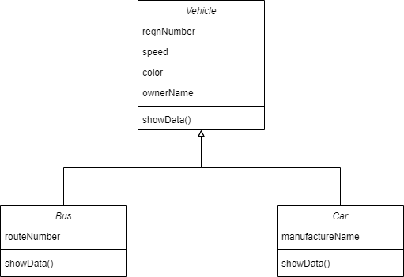 | [link](DAY-8/VehicleTest.java) |
| Create a base class `Building` that stores the `number of floors` of a building, `number of rooms` and it’s `total floor area`. Create a derived class `House` that inherits `Building` and also stores the `number of bedrooms and bathrooms`. Demonstrate the working of the classes. | 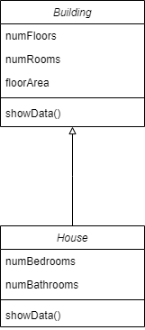 | [link](DAY-8/BuildingTest.java) |
| In the earlier program, create a second derived class `Office` that inherits `Building` and stores the `number of telephones and tables`. Now demonstrate the working of all three classes. | 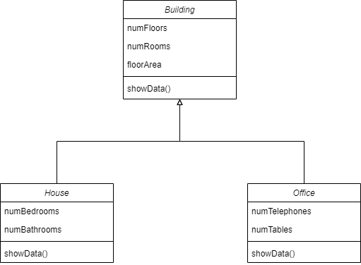 | [link](DAY-8/OfficeTest.java) |
| Write a program that shows a class hierarchy of the various `Cricket` players in a team like `Batsmen`, `Bowler` and `WicketKeeper`. | 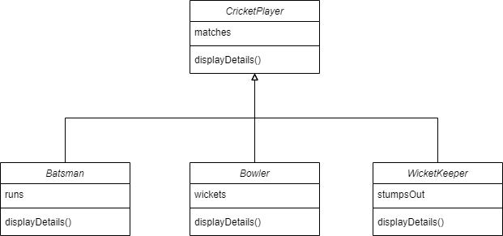 | [link](DAY-8/CricketPlayerTest.java) |
| An educational institution maintains a database of its employees. The database is divided into a number of classes whose hierarchical relationships are shown below. Write all the classes and define the methods to create the database and retrieve individual information as and when needed.  Write a driver program to test the classes. &nbsp;&nbsp;&nbsp; • Staff (code, name) &nbsp;&nbsp;&nbsp; • Teacher (subject, publication) is a Staff &nbsp;&nbsp;&nbsp; • Officer (grade) is a Staff &nbsp;&nbsp;&nbsp; • Typist (speed) is a Staff &nbsp;&nbsp;&nbsp; &nbsp;&nbsp;&nbsp; o RegularTypist (remuneration) is a Typist &nbsp;&nbsp;&nbsp; &nbsp;&nbsp;&nbsp; o CasualTypist (daily wages) is a Typist.  | 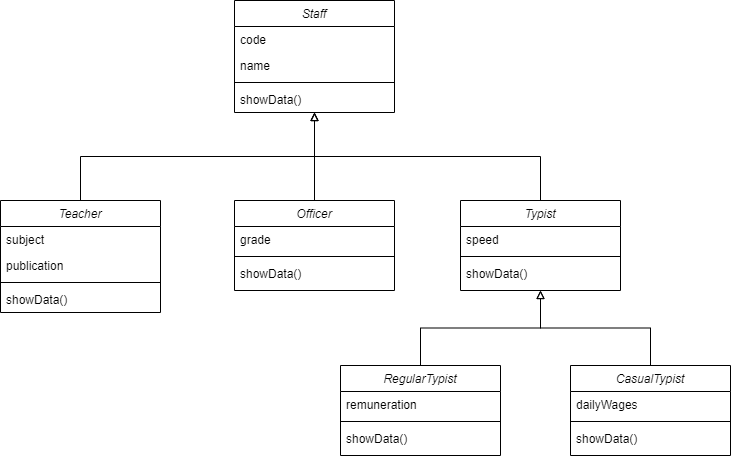 | [link](DAY-8/InstituteDatabase.java) | 

# DAY-9
| Question | Class Diagram | Link |
|----------|---------------|------|
| Create an abstract class `ThreeDObject` and derive the classes `Box`, `Cube`, `Cylinder` and `Cone` from it. The class `ThreeDObject` has methods `wholeSurfaceArea()` and `volume()`. Override these two methods in each of the derived classes to calculate the volume and whole surface area of each type of three-dimensional objects. The dimensions of the objects are to be taken from the users and passed through the respective constructors of each derived class. Write a main method to test these classes by creating only one object reference of `TheeDObject` class to hold different sub class objects. |  | [link](DAY-9/ThreeDObjectTest.java) |
| Create an abstract class `Accounts` with the following details: &nbsp;&nbsp;&nbsp; (a) Data Members: &nbsp;&nbsp;&nbsp; &nbsp;&nbsp;&nbsp; i. `Balance` &nbsp;&nbsp;&nbsp; &nbsp;&nbsp;&nbsp; ii. `accountNumber` &nbsp;&nbsp;&nbsp; &nbsp;&nbsp;&nbsp; iii. `accountHoldersName` &nbsp;&nbsp;&nbsp; &nbsp;&nbsp;&nbsp; iv. address &nbsp;&nbsp;&nbsp; (b) Methods: &nbsp;&nbsp;&nbsp; &nbsp;&nbsp;&nbsp; i. `withdrawl()` - abstract &nbsp;&nbsp;&nbsp; &nbsp;&nbsp;&nbsp; ii. `deposit()` - abstract &nbsp;&nbsp;&nbsp; &nbsp;&nbsp;&nbsp; iii. `display()` - to show the balance of the account number Create a subclass of this class `SavingsAccount` and add the following details: &nbsp;&nbsp;&nbsp; (a) Data Members: `rateOfInterest` &nbsp;&nbsp;&nbsp; (b) Methods: `calculateAmount()`  | 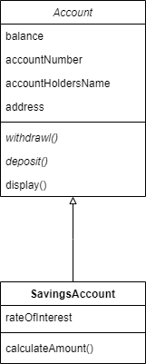 | [link](DAY-9/BankTest.java) |
| Create an abstract class `MotorVehicle` with the following details:  &nbsp;&nbsp;&nbsp; (a) Data Members: &nbsp;&nbsp;&nbsp; &nbsp;&nbsp;&nbsp; i. `modelName` &nbsp;&nbsp;&nbsp; &nbsp;&nbsp;&nbsp; ii. `modelNumber` &nbsp;&nbsp;&nbsp; &nbsp;&nbsp;&nbsp; iii. `modelPrice` &nbsp;&nbsp;&nbsp; (b) Methods: `display()` to show all the details Create a subclass of this class `Car` that inherits the class `MotorVehicle` and add the following details: &nbsp;&nbsp;&nbsp; (a) Data Members: `discountRate` &nbsp;&nbsp;&nbsp; (b) Methods: &nbsp;&nbsp;&nbsp; &nbsp;&nbsp;&nbsp; i. `display()` method to display the Car name, model number, price and the discount rate. &nbsp;&nbsp;&nbsp; &nbsp;&nbsp;&nbsp; ii. `discount()` method to compute the discount  | 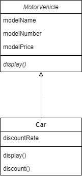 | [link](DAY-9/MotorVehicleTest.java) |
Implement the below Diagram. Here `AbstractProduct` is only abstract class. | 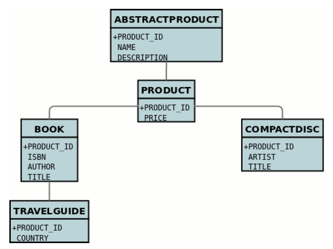 | [link](DAY-9/ProductTest.java) |
Implement the below Diagram. Here, `Asset` class is an abstract class containing an abstract method `displayDetails()` method. `Stock`, `Bond` and `Savings` class inherit the `Asset` class and `displayDetails()`method is defined in every class. | 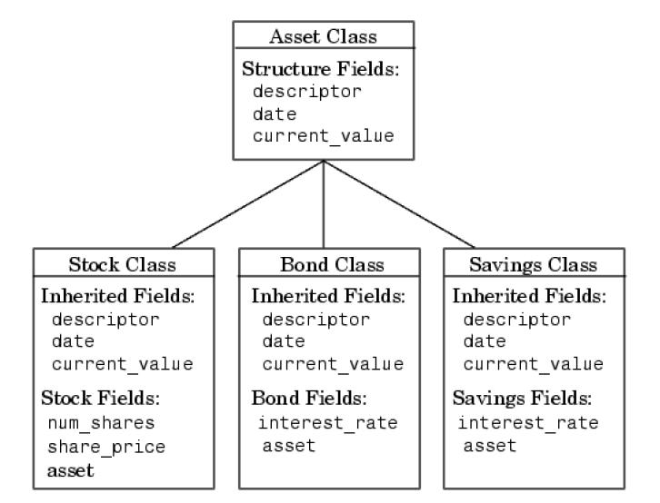 | [link](DAY-9/AssetTest.java) |

# DAY-10
| Question | Class Diagram | Link |
|----------|---------------|------|
| Create an interface `Department` containing attributes `deptName` and `deptHead`. It also has abstract methods for printing the attributes. Create a class hostel containing `hostelName`, `hostelLocation` and `numberofRooms`. The class contains methods for getting and printing the attributes. Then write `Student` class extending the `Hostel` class and implementing the `Department` interface. This class contains attributes `studentName`, `regdNo`, `electiveSubject` and `avgMarks`. Write suitable `getData` and `printData` methods for this class. Also implement the abstract methods of the `Department` interface. Write a driver class to test the `Student` class. The program should be menu driven containing the options:  &nbsp;&nbsp;&nbsp; (a) Admit new student  &nbsp;&nbsp;&nbsp; (b) Migrate a student  &nbsp;&nbsp;&nbsp; (c) Display details  For the second option a search is to be made on the basis of the entered registration number.   | 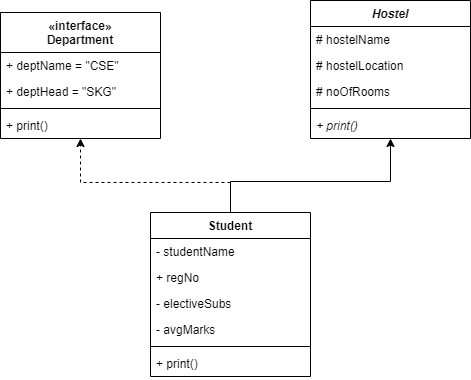 | [link](DAY-10/StudentTest.java) |
| Write a program to implement the Multiple Inheritance kind of framework (`Bank` Interface, `Customer` & `Account` classes). | 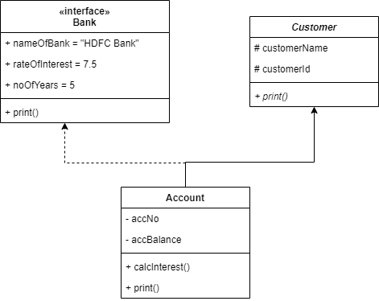 | [link](DAY-10/BankTest.java) |
| Write a program to implement the Multiple Inheritance kind of framework (`Gross` Interface, `Employee` & `Salary` classes). | 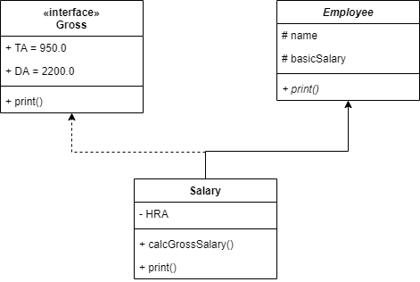 | [link](DAY-10/SalaryTest.java) |
| Program to create a interface `Mango` and implement it in classes `Winter` and `Summer`. | 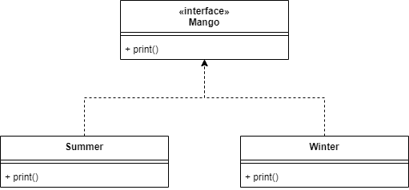 | [link](DAY-10/MangoTest.java) |
| Implement the following diagram. | 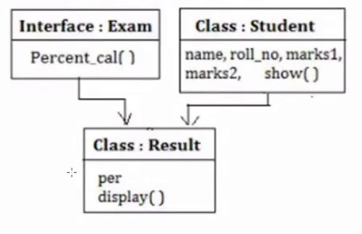 | [link](DAY-10/ClassTest.java) |

# DAY-11
| Question | Link |
|----------|------|
| **Try-Catch (Exception Handling)**: You will be given two integers x and y as input, you have to compute x/y . If x and y are not 32 bit signed integers or if is zero, exception will occur and you have to report it. Read sample Input/Output to know what to report in case of exceptions. | [link](DAY-11/1.java) |
| **Calculator (Exception Handling)**: Create a class MyCalculator which consists of a single method long power(int, int). This method takes two integers, n and p, as parameters and finds n^p. If either n or p is negative, then the method must throw an exception which says "n or p should not be negative". Also, if both n and p are zero, then the method must throw an exception which says "n and p should not be zero". For example, -4 and -5 would result in java.lang.Exception: n or p should not be negative. Complete the function power in class MyCalculator and return the appropriate result after the power operation or an appropriate exception as detailed above. | [link](DAY-11/2.java) |
| **Factorial (Exception Handling)**: Write a program called Factorial.java that computes factorials and catches the result in an array of type long for reuse. The long type of variable has its own range. For example 20! Is as high as the range of long type. So check the argument passes and “throw an exception”, if it is too big or too small. If x is less than 0 throw an IllegalArgumentException with a message “Value of x must be positive”. If x is above the length of the array throw an IllegalArgumentException with a message “Result will overflow”. Here x is the value for which we want to find the factorial. | [link](DAY-11/3.java) |
| **Student Examination (Exception Handling)**: Consider a Student examination database system that prints the mark sheet of students. Input the following from the command line. (a) Student’s Name (b) Marks in six subjects. These marks should be between 0 to 50. If the marks are not in the specified range, raise a RangeException, else find the total marks and prints the percentage of the students. | [link](DAY-11/4.java) |
| **Hot-Cold (Exceptions Handling)**: Create two user-defined exceptions named “TooHot” and “TooCold” to check the temperature (in Celsius) given by the user passed through the command line is too hot or too cold. If temperature > 35, throw exception “TooHot”. If temperature <5, throw exception “TooCold”. Otherwise, print “Normal” and convert it to Farenheit. | [link](DAY-11/5.java) |

# DAY-12
| Question | Link |
|----------|------|
| **Access the Priority (Thread)**: Write a Java Program to Access the Priority You Can Use Method With Thread Object. | [link](DAY-12/1.java) |
| **Synchronize the Threads (Thread)**: Write a Java Program to Synchronize the Threads Acting on the Same Object. The Synchronized Block in the Program can be Executed by Only One Thread at a Time. | [link](DAY-12/2.java) |
| **Priority Thread (Thread)**: Create 4 threads with priority 1,3,5,7 respectively. Update a counter in each of the threads for 10 ms. Print the final value of count for each thread. | [link](DAY-12/3.java) |
| **Thread Class (Thread)**: Write a Java Program to Check Whether Define a Thread Class Without Defining run() Method in the Class. | [link](DAY-12/4.java) |
| ~~**PARAMS (Applet)**: Design an applet that will display a text as scrolling marquee. The text can be changed by setting different “PARAMS” value.~~ | ✖ |